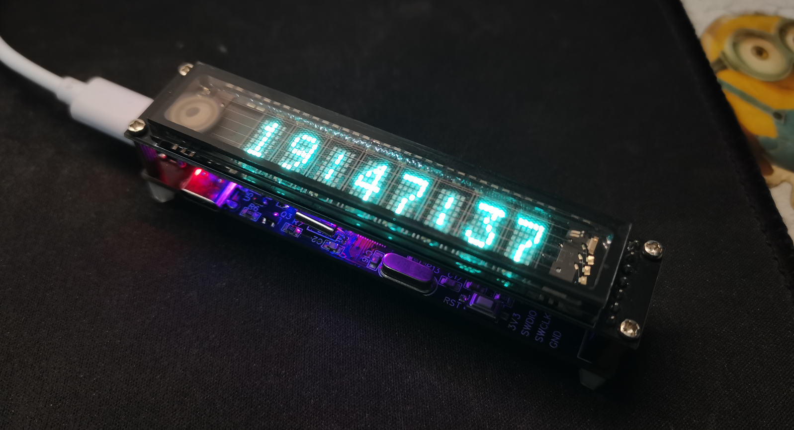
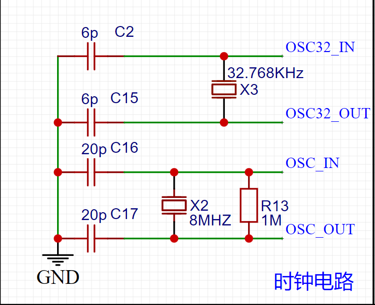
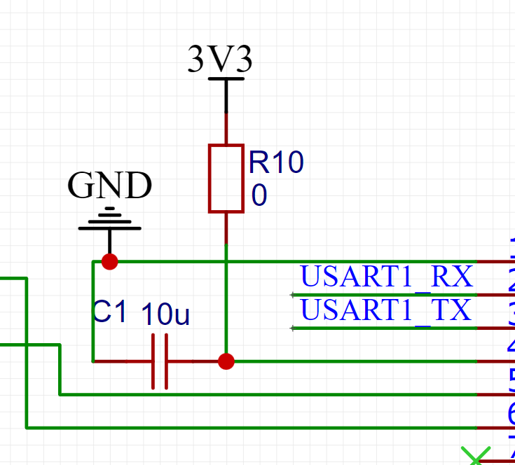
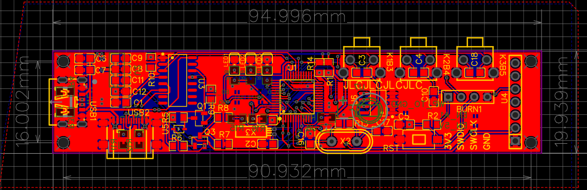
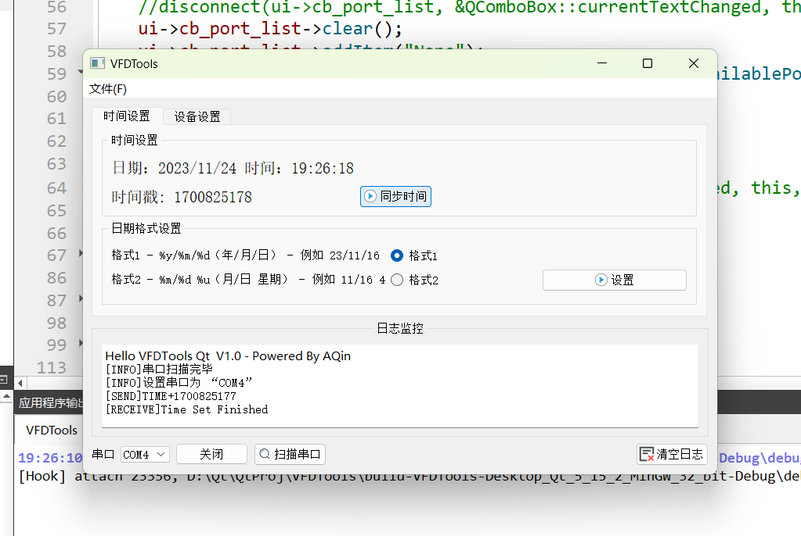
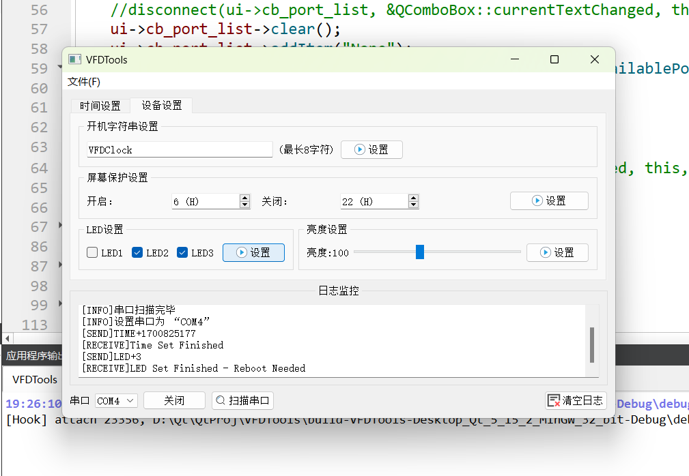
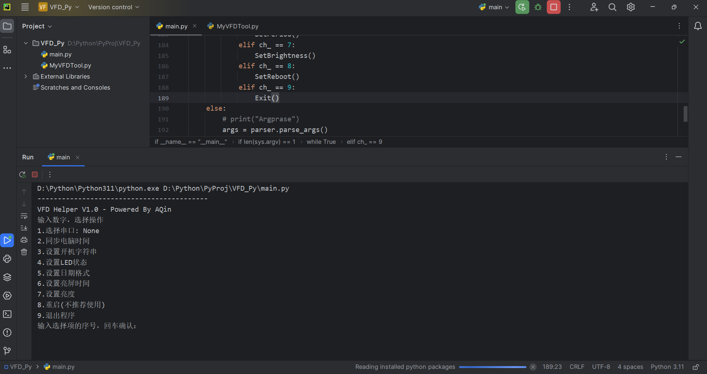
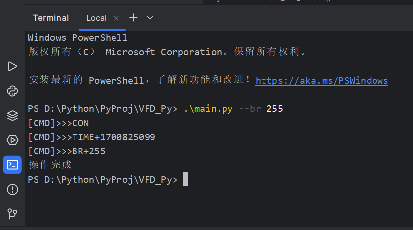

# STM32 - VFD Clock



### 简介

基于STM32F103C8T6的时钟，屏幕是VFD屏幕（Vaccum Fluorescent Display，真空荧光显示屏）

**功能**：时间显示，日期显示，开机显示字符串，可控的三个彩色LED（V1版本目前除了可控的常亮常灭没有其他功能），按键校时，上位机校时，设置亮屏时间，支持一键烧录

**上位机功能**：校时，设置日期显示格式，设置开机字符串，屏幕保护设置，LED设置，亮度设置（Python版的上位机提供了命令行批量操作，Qt版没有）

### 说明

#### **1.时钟电路**



32.768KHz晶振的起振电容（C2，C15）最好选择6pF，或者不贴

我选的低速晶振是是±5ppm的高精度晶振，实测在24℃的室内大概每天快4秒，如果能买到更高精度的晶振也可以用

#### **2.串口电路**



C1是ch340c的去耦电容，贴0.1uF或者10uF，R10可以不贴

#### 3.测试点

背后有多个测试点

**B1_0：** STM32单片机BOOT1拉低（**需要连接**）

**B0_0：** STM32单片机BOOT0拉低（不需要连接，串口烧录电路自带下拉，但是连接也没什么影响，可以删去）

**B1_1：** STM32单片机BOOT1拉高（不需要连接，可以删去）

**B0_1：** STM32单片机BOOT0拉高（不需要连接，可以删去）

**WP_TO_GND：** EEPROM的WP引脚拉低，拉高之后AT24C02进入写保护模式，这里的设计实际上有问题，测试点另一边应该连接VCC，（写保护模式启用后，数据只能读出不能写入，一般不需要连接，可以删去）

**EN_A1：** VFD屏幕的EN引脚是否连接到单片机的PA1引脚（**需要连接**）

**EN_5V：** VFD屏幕的EN引脚是否连接到5V引脚，这样屏幕不受单片机控制了（不需要连接，可以删去）

大部分不需要连接的测试点都可以删去，设计的时候是为了防止再版多弄了几个

#### **4.安装**



安装孔直径 2.1mm，使用M2的螺丝和铜柱即可，高度建议选择11mm

PCB打样时厚度建议选择1mm

注意这是为VFD屏幕量身定做的底板，我用的VFD屏幕是淘宝店铺  “实用芯片模块”  家的  “8-MD-06INKM模块FUTABA点阵C51显示STM32模组VFD荧光屏8MD06INKM” ，尽量买这个，别的不敢保证尺寸和引脚定义一样

### 上位机

上位机提供了Qt版的图形化界面和Python版的控制台程序，两个版本的上位机都提供源代码

**Qt版：**





Qt版的编译好的可执行文件在可以在仓库的Release里面下载

上位机和VFD时钟使用串口通信，时钟上提供了两个USB-Type-C接口，下面的可以与电脑通信，需要安装CH340的驱动，官网链接：

[CH340C驱动程序下载链接]: https://www.wch.cn/products/CH340.html?

程序启动时会扫描串口，如果启动时时钟的通信接口没有插到电脑上，再次扫描串口即可在串口的下拉列表里找到设备对应的串口

具体使用方法不过多赘述

**Python版：**





python的程序支持控制台直接操作和使用命令行操作，这是为了防止Qt程序无法正常运行的备用方案，需要自己安装解释器（开发时使用的解释器是Python 3.11.4），并安装PySerial库

```
pip install pyserial
```

直接运行main.py即可启动控制台程序，不过多赘述

python程序支持命令行参数，以下是使用例以及参数解释

参数：

```
-p		# 有参数，指定串口设备，如果不指定或者指定为 ‘AUTO’，则自动寻找设备
--st	# 有参数，是否需要同步电脑时间 0 为不需要，1为需要，默认为1
--led	# 有参数，指定三个LED的状态，使用一个整数代替，值的从低位到高位分别代表LED3~LED1的状态，也就是说 7 代表全亮， 0 代表全灭
--dfmt	# 有参数，日期显示格式，1 为 %y/%m/%d， 2 为 %m/%d  %u
--ssd	# 有参数，指定亮屏和息屏时间，使用一个四位整数代替，例如0723表示早上7点亮屏，直到晚上23点息屏。如果需要全天候显示，让这个四位数的前两位数值和后两位数值相等即可，比如0000
--br 	# 有参数，设置亮度，范围是 0 ~ 255，0最暗，255最亮
--str # 有参数，设置开机字符串
```

使用例

```
./main.py --led 5 --dfmt 2 --br 100
```

效果：LED1和LED3亮起，日期格式设置为格式2，亮度设置为100

### 更新日志
#### V1.1 - 2023/12/03
  修复了进入息屏模式之后屏幕仍然会发亮的Bug

  修复发送Reboot命令后彻底死机的Bug
#### V1.2 - 2023/12/05
  增加了新的计时器功能，在时间显示界面按下BTN1后进入计时器模式，按下BTN2开始计时，再次按下BTN2停止计时，暂停状态下按下BTN1会清零并回到主界面，在运行状态下按下BTN1会暂时回到主界面，计时器在后台运行，计时器计时的最大时间是10小时，到达10小时会自动停止

#### V1.3 - 2023/12/10

增加了熄屏状态下强制亮屏的操作，即在熄屏状态下（到达设置的熄屏时间）按下任意按键即可亮屏20秒
